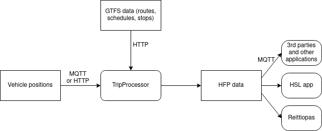

# suomenlinna-ferry-hfp 

Application for producing [HFP](https://digitransit.fi/en/developers/apis/4-realtime-api/vehicle-positions/) data from vehicles that have only location data available. The location data will be matched to a scheduled trip from GTFS data and published over MQTT for customers.

## Development

Gradle build system is used.

## Usage

The application can be run with Docker. Environment variables are used to configure how the application works. Currently there are two modes for the application, which can be selected with `CONFIG` environment variable: `SBDRIVE` and `SUOMENLINNA`, which use configuration files `sbdrive.conf` and `suomenlinna.conf` respectively. See the specified file and `application.conf` for other available environment variables.

## Versioning

This application uses calendar versioning with the following pattern: `YYYYMMDD`. New versions can be published by creating a release in GitHub. The Docker image of this application uses `latest` tag for the latest build of master branch and `prod` tag for the latest build made from a tagged commit. Specific versions are also available with the same Docker tag as the Git tag of the version.

## Architecture

The application works by matching vehicle positions to scheduled trips by checking whether the vehicle is near the first stop of the trip when the trip should begin. Vehicle positions can be listened over MQTT or polled using HTTP. Schedules for the trips are found from a GTFS package that will be downloaded regularly.

HSL GTFS data is downloaded hourly and stored in a local hsl.zip file.

Currently the application is optimized for matching Suomenlinna ferry positions available from [meri.digitraffic.fi](https://www.digitraffic.fi/meriliikenne/) to their scheduled trips, but other vehicles are also supported (e.g. robot buses). See `PollingVehicleStateProvider` and `MqttVesselLocationProvider` for examples.
